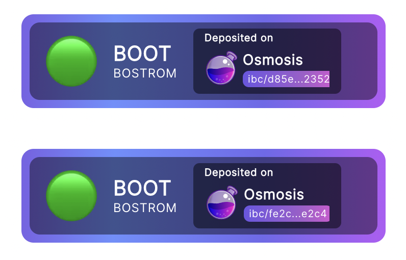
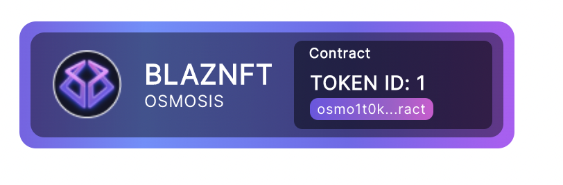
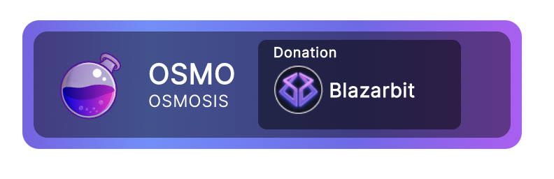
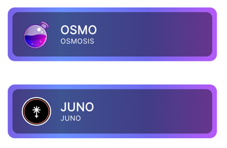
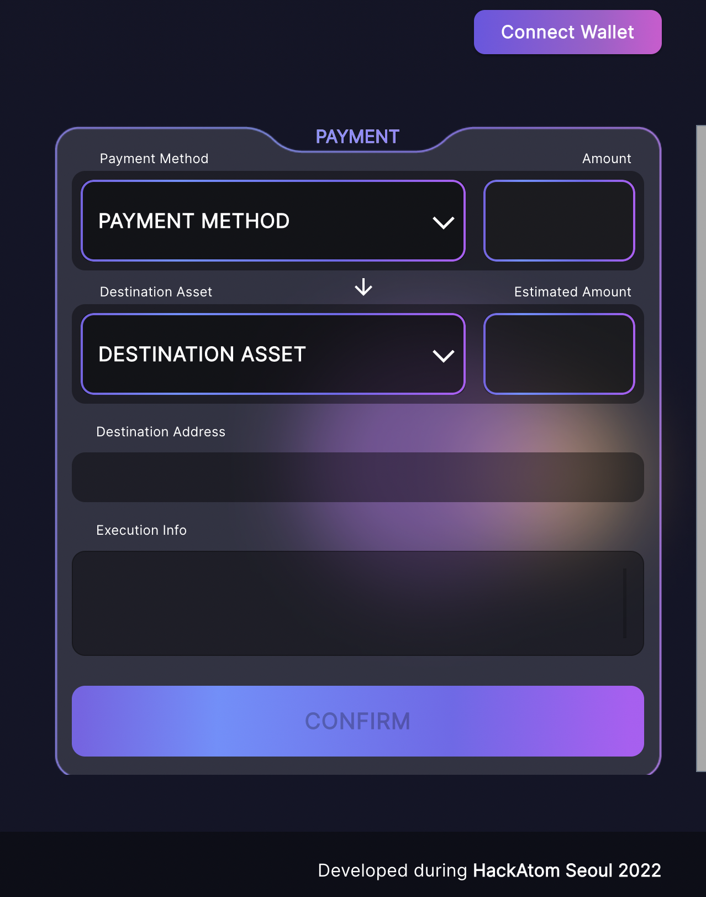
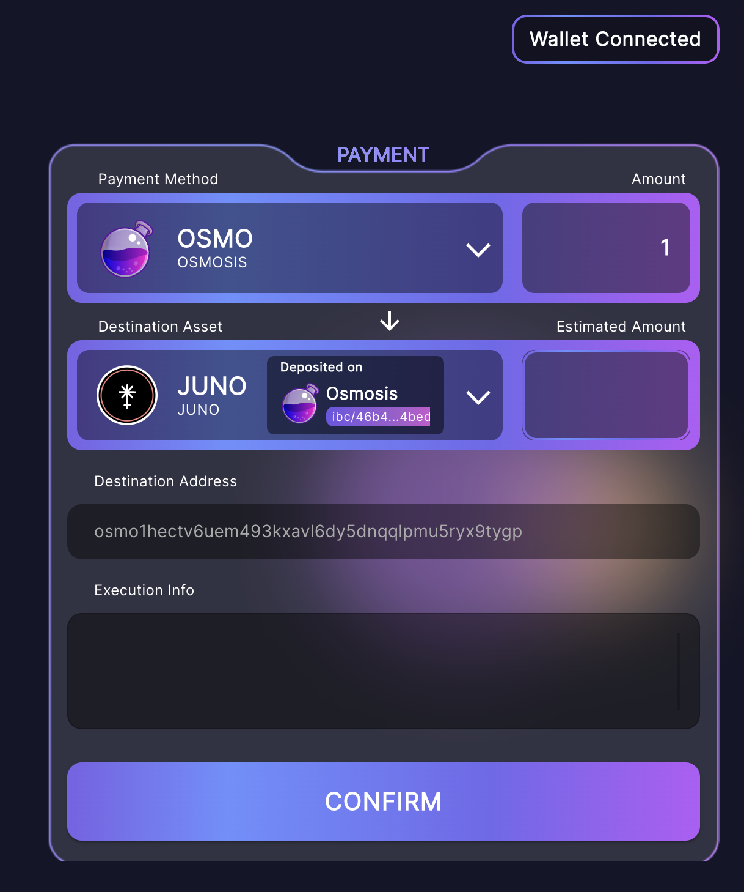
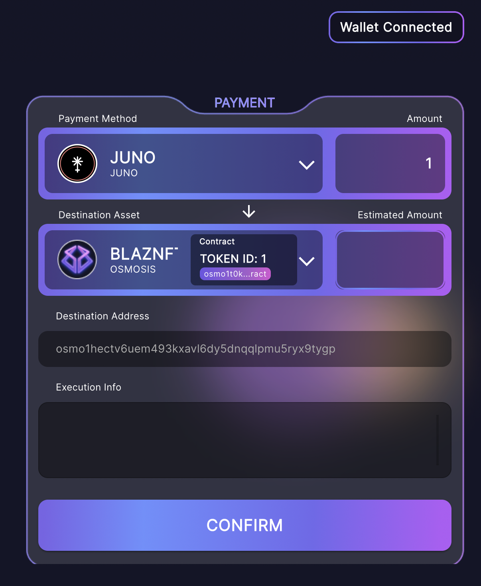
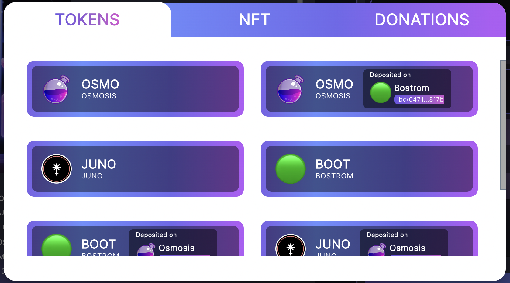
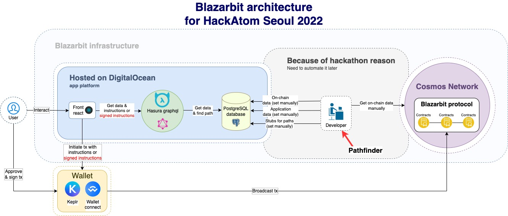
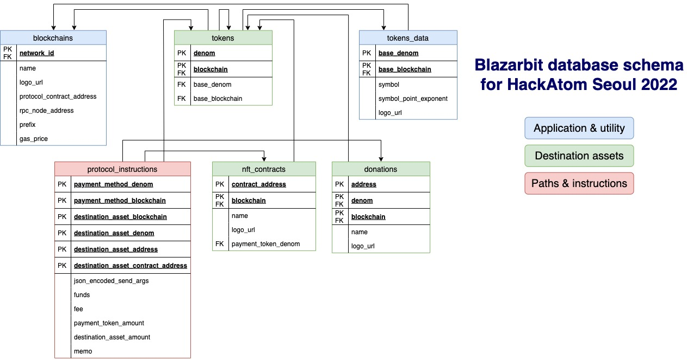

# HackAtom


> **Don't be an exchange, be an Inter-blockchain Payment System!**

* [Blazarbit](https://blazarbit.com/) - a site that clearly shows how you can work with ibc.
* [github.com/blazarbit](https://github.com/blazarbit) - github project repository, which contains all the developments of this project.

## Content
* [Content](#Content)
* [Interface](#Interface)
* [Architecture](#Architecture)
* [Database](#Database)
* [Protocol](#Database)
* [Repositories](#Repositories)

## Interface

 Tokens                              |  NFT                                 | Donation                           |
:----------------------------------:|:------------------------------------:|:-----------------------------------:|
   |    |  |
   |                                      |  |

Initial form                        |  On one chain exchange example       | Inter-blockchain NFT purchase       | Modal first state |
:----------------------------------:|:------------------------------------:|:-----------------------------------:|:----:|
  |    |   |  |


## Architecture



## Database



## Protocol

### General transfer
```
{"transfer":{"address":"wasm1eg9twjpekcumz52fajvqd3equnlfeqcls8w368"}}
```

### IBC transfer from Osmosis to Bostrom
```
{
"ibc_transfer": {
"address": "bostrom1v75ufqsddpeq38yphd89ztyt8gg2v73hdjexvd",
"channel_id": "channel-377"
}
}
```
### Non-ibc(general) contract-hop example with double-hop
```
{
"contract_hop":{"contract_addr":"wasm13cnz8lvz0s0hpuaguutaqqjgw00j0qcp5umfqz46cm83glp97pnse2qyfx","commands":[{
"contract_hop":{"contract_addr":"wasm19rwewzc04p7nxramwy7v640q9ptk7w2anr7xrvar452dwja468cqta0pee", "commands":[{
"transfer":{"address":"wasm1eg9twjpekcumz52fajvqd3equnlfeqcls8w368"}
}]
}}]
}}
```
### Swap on Osmosis example
```
{
"swap2": {
"pool_id": 1,
"token_out_denom": "ibc/27394FB092D2ECCD56123C74F36E4C1F926001CEADA9CA97EA622B25F41E5EB2",
"token_out_min_amount": "301620"
}
}
```
### NFT fixed price init
```
{
"cw20_address": "osmo1v75ufqsddpeq38yphd89ztyt8gg2v73hx679yc",
"max_tokens": 100,
"name": "Example NFT",
"owner": "osmo1v75ufqsddpeq38yphd89ztyt8gg2v73hx679yc",
"symbol": "ENFT",
"token_code_id": 542,
"token_uri": "https://cosmos.network",
"unit_price": "20"
}
```
### NFT on chain init
```
{
  "minter": "osmo1w8afpz2xzneplav3dkyadqsrwg3y2u0rre2gk6snnc0eke99r0vswye7pc",
  "name": "ExampleNFT",
  "symbol": "ENFT"
}
```

### NFT mint
```
{
"mint": {
"owner": "osmo1v75ufqsddpeq38yphd89ztyt8gg2v73hx679yc",
"token_id": "test-token-id-0",
"token_uri": "https://google.com"
}
}
```
### NFT mint check
```
{
owner_of: {
token_id: 'test-token-id-0'
}
}
```
### NFT purchase via our mint logic
```
{
"purchase_n_f_t": {
"contract_addr": "osmo1zrjcljy56kdsrrvzuxgjtd2m0j6v9uvkrszrgfuzmmhfacz44h2sshwd42",
"owner": "osmo1v75ufqsddpeq38yphd89ztyt8gg2v73hx679yc",
"token_id": "test_nft_purchase_via_mint_0",
"token_uri": "https://google.com"
}
}
```
### Inter-blockchain cross-contract hop
```
//todo: need to provide an exampla later
```

## Repositories

* [blazarbit/HackAtom](https://github.com/blazarbit/HackAtom) - blazarbit project root documentation repository
* [blazarbit/front](https://github.com/blazarbit/front) - dApp for interacting with our blazarbit protocol & database.
* [blazarbit/protocol](https://github.com/blazarbit/protocol) - CosmWasm Inter-blockchain protocol implementation
* [blazarbit/hasura](https://github.com/blazarbit/hasura) - graphql hasura api configuration & postgresql database migrations
